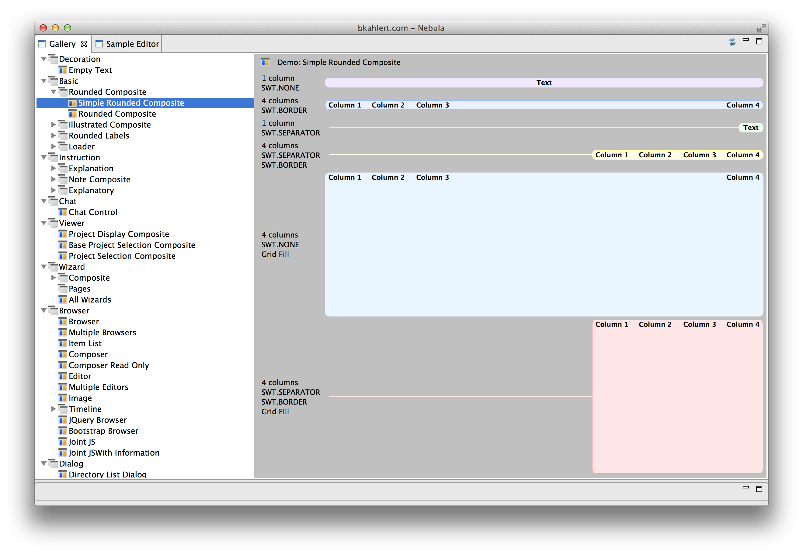
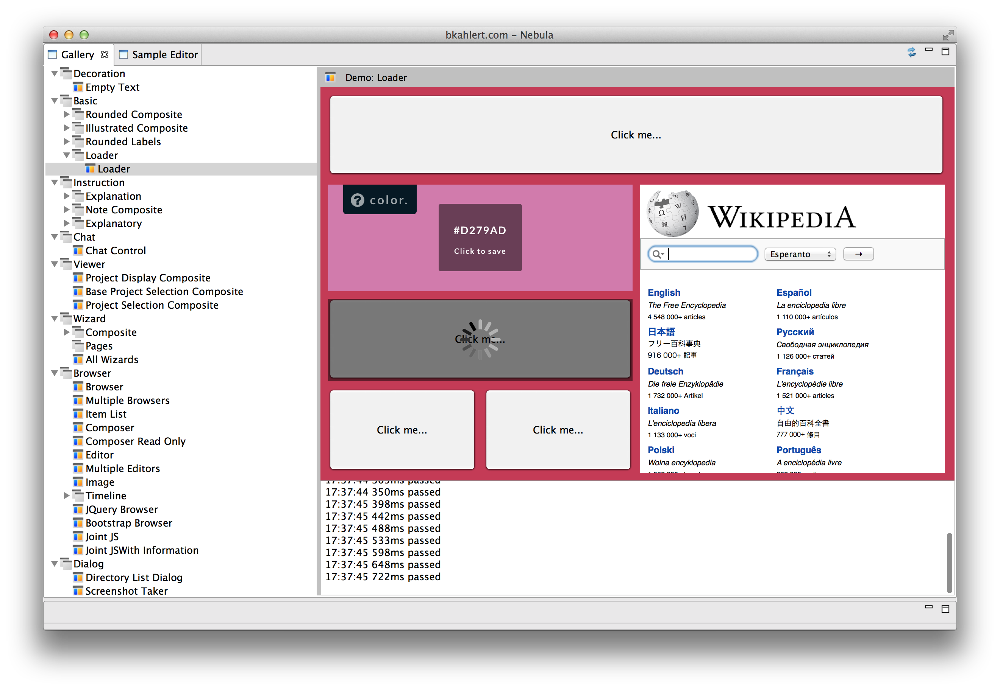
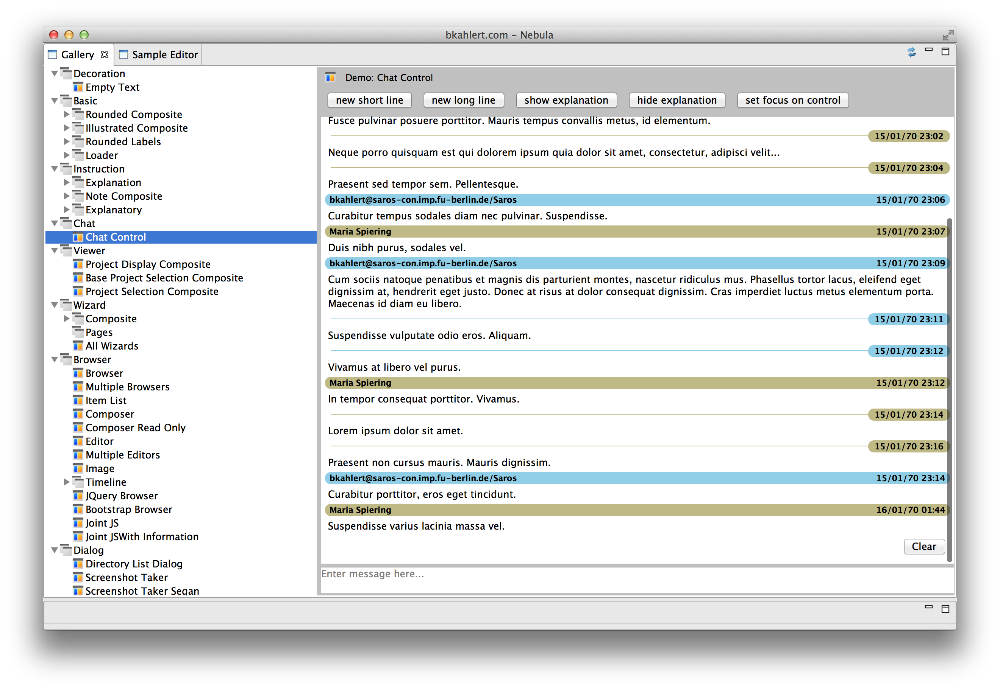
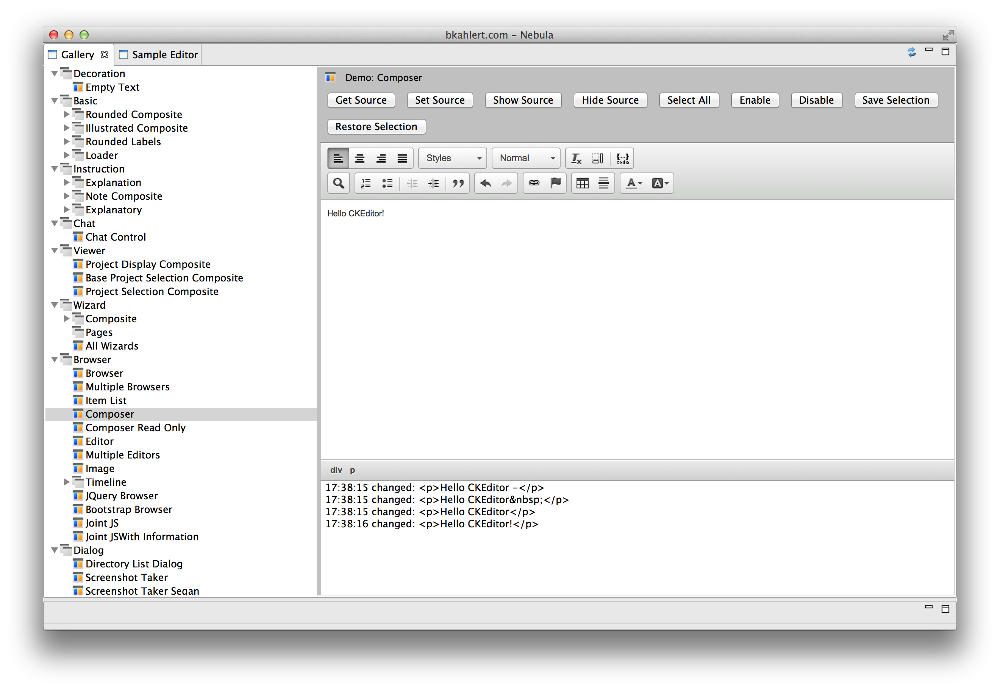
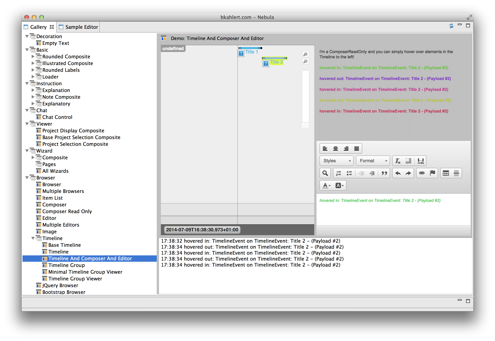
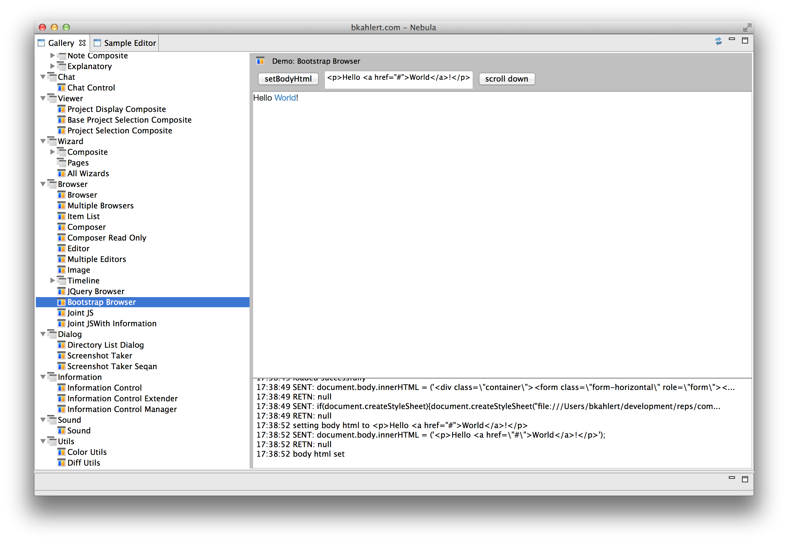
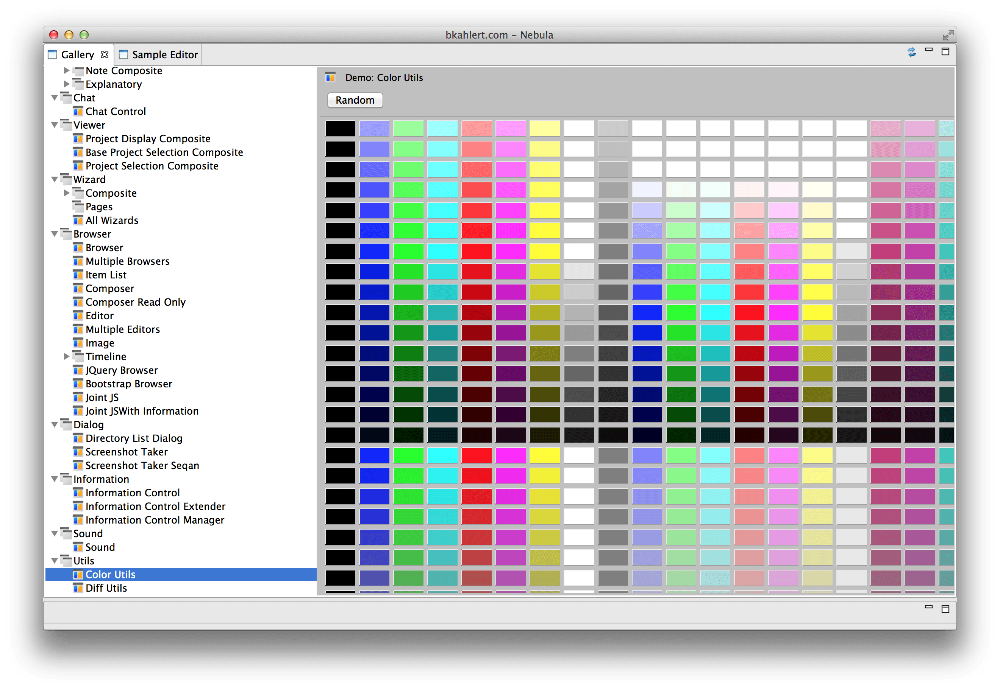

bkahlert.com - Nebula
=====================

This project provides a huge bunch of widgets for Eclipse.

The widgets include
- basic widgets like
  - rounded labels & composites
  - loader overlays to indicate long running computations
  - ...
- complex widgets like
  - chats
  - composers / editors
  - timelines
  - a highly tweaked Browser that allows encapsulating web applications to form very complex and utility classes like
- utility classes
  - color utils (support for 32bit HSB, 32bit RGB, color conversion)
  - ...

To check the exact functionality simply run the imported Eclipse plug-in as a Eclipse Application.
The application opens interactive demos for all provided widgets.

Screenshots
-----------

Rounded Composite

Loader Overlay

Chat Control

Composer

Timeline

Bootstrap Browser

Color Utils

License
-------

[The MIT License (MIT)](LICENSE)  
Copyright (c) 2011-2014 [Björn Kahlert, Freie Universität Berlin](http://www.mi.fu-berlin.de/w/Main/BjoernKahlert)
